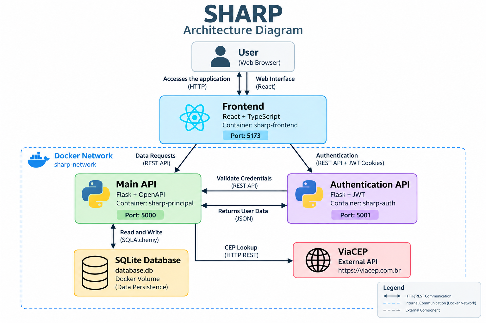

# agenda-compartilhada-frontend (SHARP)

Repositorio criado para o desenvolvimento do frontend do projeto SHARP - MVP Full Stack.

## Title: SHARP

I------------------------------------------------------------------------------------------I

## Project Description

Frontend application for managing shared activities and schedules between users.

The application allows users to authenticate, create and organize activities into groups, create schedules, manage participants and use Brazilian postal codes to retrieve address information.

The frontend communicates with the SHARP Principal API for application resources and with the SHARP Authentication API for authentication and session management.

I------------------------------------------------------------------------------------------I

## Development Tools

React
TypeScript
Vite
React Router DOM
Tailwind CSS
Lucide
Docker

I------------------------------------------------------------------------------------------I

## Project Architecture

SHARP is composed of three developed components and one external API:

**Frontend**
- React and TypeScript application.
- Runs on port 5173.
- Provides the user interface of the SHARP application.
- Communicates with the Principal API to manage application resources.
- Communicates with the Authentication API for login, session validation, token refresh and logout.

**Principal API**
- Python and Flask REST API.
- Runs on port 5000.
- Manages users, groups, activities, schedules and participants.
- Stores application data using SQLite.
- Communicates with ViaCEP to retrieve address information.

**Authentication API**
- Python and Flask REST API.
- Runs on port 5001.
- Responsible for registration, login, JWT validation, token refresh and logout.
- Uses HTTP-only cookies to manage the authenticated session.

**External API**
- ViaCEP.
- Used by the Principal API to retrieve address information from Brazilian postal codes.
- The processed address information is used by the frontend when creating or editing schedules.

## Project Architecture

The following diagram illustrates the architecture and communication between the components of the Sharp application:

I------------------------------------------------------------------------------------------I

## Local Installation

These instructions can be used to execute the Frontend locally without Docker.

**Prerequisites**

Node.js
npm
Git

For all application features to work, the SHARP Principal API must be running on port 5000 and the SHARP Authentication API must be running on port 5001.

**1. Clone the repository:**

git clone https://github.com/T-Quaresma/agenda-compartilhada-frontend/tree/mvp3

**2. Go to the project directory:**

cd agenda-compartilhada-frontend

**3. Install the dependencies:**

npm install

**4. Start the development server:**

npm run dev

**The Frontend will be available at:**

http://localhost:5173

Open this address in a web browser to access the SHARP application.

I------------------------------------------------------------------------------------------I

##  Docker Execution

The Frontend can also be executed inside a Docker container.

**Prerequisites**

Docker Desktop must be installed and running.

The Principal API and Authentication API must also be running for all application features to work.

**1. Clone the repository:**

git clone https://github.com/T-Quaresma/agenda-compartilhada-frontend/tree/mvp3

**2. Enter the project directory:**

cd agenda-compartilhada-frontend

**3. Build the Docker image:**

docker build -t sharp-frontend .

**4. Create the Docker network used by SHARP:**

docker network create sharp-network

If the network already exists, it does not need to be created again.

**5. Start the Frontend container:**

docker run -d --name sharp-frontend \
  --network sharp-network \
  -p 5173:5173 \
  sharp-frontend

**The parameters used in this command are:**

--name sharp-frontend  
Defines the name of the container.

--network sharp-network  
Connects the container to the SHARP Docker network.

-p 5173:5173  
Makes the Frontend available through port 5173.

sharp-frontend  
Defines the Docker image used to create the container.

**The Frontend will be available at:**

http://localhost:5173

**Important:**

The Frontend communicates with the APIs through the browser.

The Principal API must be available at:

http://localhost:5000

The Authentication API must be available at:

http://localhost:5001

I------------------------------------------------------------------------------------------I

##  Docker Commands

**To view running containers:**

docker ps

**To view all containers:**

docker ps -a

**To view Docker images:**

docker images

**To stop the Frontend:**

docker stop sharp-frontend

**To start the existing Frontend container again:**

docker start sharp-frontend

**To stop and remove the Frontend container:**

docker stop sharp-frontend

docker rm sharp-frontend

I------------------------------------------------------------------------------------------I

##  Application Functions

**Authentication**

- Login using email and password.
- Authentication session validation.
- Automatic access token refresh when necessary.
- Logout.
- Protected application routes that require an authenticated session.

**Groups**

- Create groups to organize activities.
- Add an optional image to a group.
- Select a group to filter its activities.
- Update group information.
- Delete groups.

**Activities**

- Create activities.
- Associate activities with groups.
- Add a name, description and optional image.
- Search and display activities.
- Update activities.
- Delete activities.

**Schedules**

- Create schedules associated with activities.
- Configure name and description.
- Configure start and end dates.
- Configure start and end times.
- Configure location.
- Configure frequency.
- Update schedules.
- Delete schedules.

**Participants**

- Add users as participants to schedules.
- Display participants associated with a schedule.
- Remove participants from schedules.

**CEP Search**

- Search for Brazilian addresses using a CEP.
- Receive address information processed by the Principal API.
- Automatically fill location information that can still be edited by the user.

I------------------------------------------------------------------------------------------I

## Authentication Flow

The Frontend communicates with the Authentication API through HTTP requests using credentials.

Authentication tokens are stored as HTTP-only cookies and are not directly accessed by the React application.

**Login flow:**

Frontend -> Authentication API -> Principal API -> Credential Verification

After successful authentication, the Authentication API creates the access and refresh tokens.

**Protected route flow:**

Frontend -> Authentication API -> Access Token Validation

If the access token is valid, the user can access the protected page.

**Expired access token flow:**

Frontend -> Authentication API -> Refresh Token -> New Access Token

If the access token has expired, the Frontend requests a new access token using the refresh token and validates the session again.

**Logout flow:**

Frontend -> Authentication API -> Authentication Cookies Removed

I------------------------------------------------------------------------------------------I

## External API Integration

The Frontend uses the Principal API to access address information provided by ViaCEP.

The Frontend does not communicate directly with ViaCEP.

**Communication flow:**

Frontend -> Principal API -> ViaCEP

After the Principal API processes the ViaCEP response, the Frontend receives:

- Street
- Neighborhood
- City
- State

The information is used to help fill the location field when creating or editing a schedule.

The location remains editable after the CEP search.
